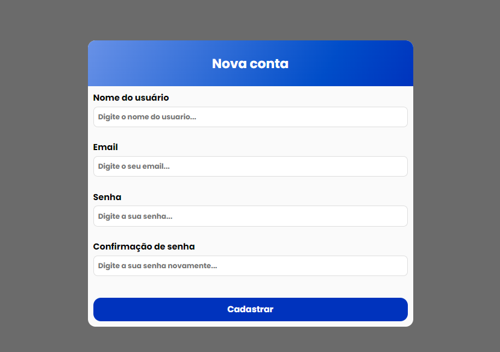

<h1 align="center">FORMULÁRIO PARA CADASTRO DE USUÁRIO</h1>

 <a href="#about">About</a> •
 <a href="#tools">Tools</a> • 
 <a href="#status">Status</a> • 
 <a href="#requisitos">Requisitos</a> • 
 <a href="#links">Links</a> 

<h2 id="about"> About 📕</h2>
 Página para cadastro de usuário com validação de dados preenchidos. Esta atividade foi realizada com o intuito de aprendizado e aperfeiçoamento de minhas skills como programador.

<h2 id="tools"> Tools 🔨</h2>

- HTML
- CSS
- JAVASCRIPT

<h2 id="status"> Status ⚙️</h2>
<h3 align="center"> Atividade finalizada 🚀</h3>

<h2 id="requisitos"> Requisitos 💻 </h2>
 Possuir um navegador com suporte para HTML5, CSS3 e JavaScript.

<h2 id="links"> Links 🔗</h2>

- [Página do projeto através do Github Pages](https://victoraugusto310304.github.io/Cadastro--html--css--javascript-/)

- [Repositório do projeto](https://github.com/VictorAugusto310304/Cadastro--html--css--javascript-)